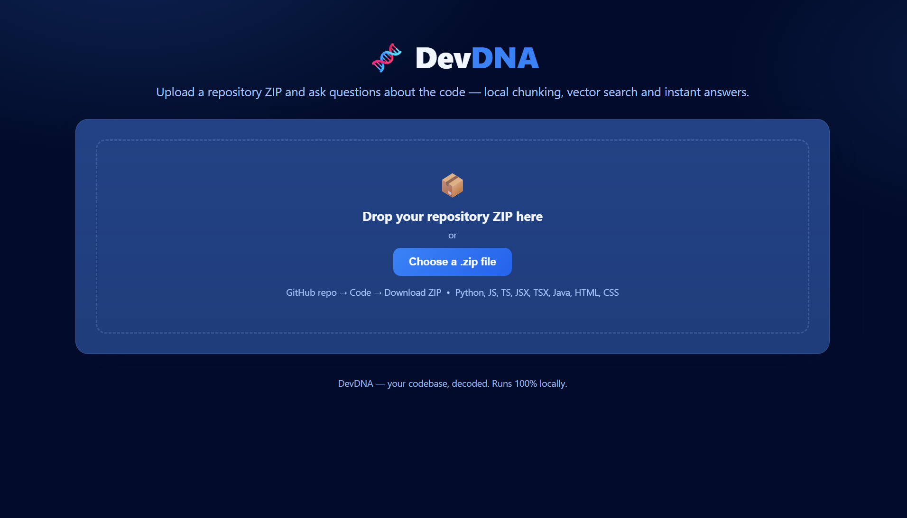
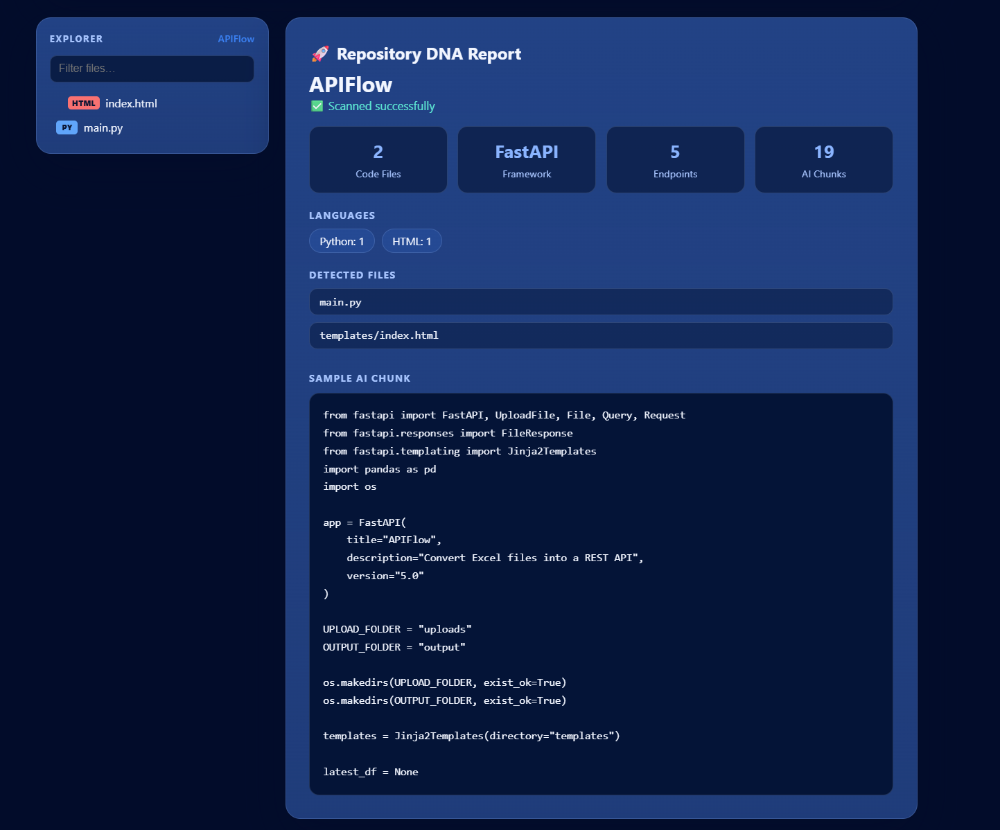
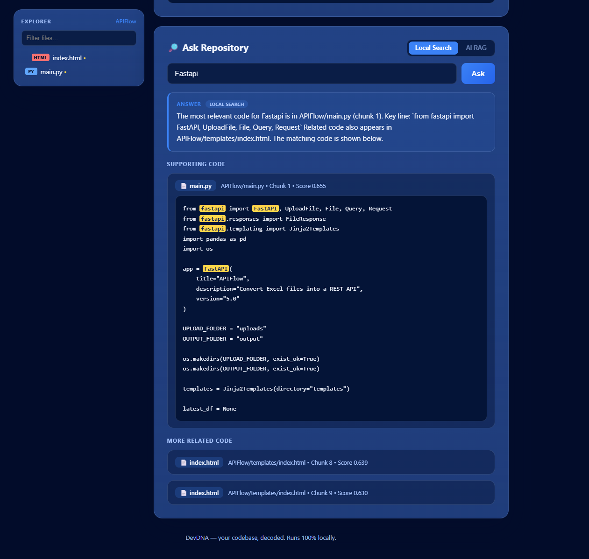

# 🧬 DevDNA

AI-powered Codebase Knowledge Assistant built with FastAPI.

## Overview

DevDNA allows users to upload a GitHub repository as a ZIP file, automatically scan the codebase, build a local vector index, and ask natural language questions about the project.

## Features

- Upload GitHub repository ZIP
- Automatic codebase scanning
- Multi-language support (Python, JavaScript, TypeScript, Java, HTML, CSS)
- Local code chunking
- Vector search
- Repository explorer
- AI-style code explanations
- Modern responsive UI

## Tech Stack

- Python
- FastAPI
- Jinja2
- HTML
- CSS
- JavaScript

## Current Status

- Local semantic search
- Persistent repository indexing
- Interactive code viewer

## Screenshots

### Dashboard



### Repository DNA Report



### Ask Repository



## Run Locally

```bash
pip install -r requirements.txt
uvicorn backend.main:app --reload
```

Open:

```
http://127.0.0.1:8000
```

## Future Improvements

- GitHub URL scanning
- RAG with OpenAI
- PDF repository reports
- Better repository visualization
